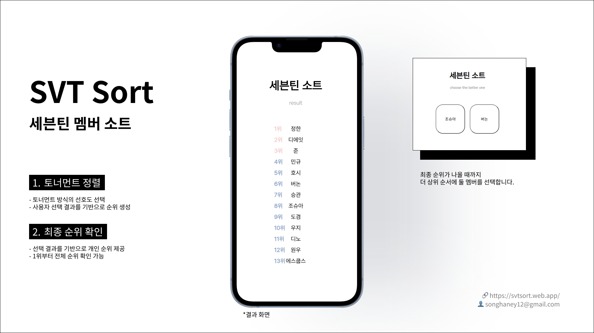

svt sort

## 🧑‍💻 프로젝트 소개

> 세븐틴 멤버를 토너먼트 방식으로 정렬하여 개인 취향 순위를 확인할 수 있는 웹 사이트입니다.<br>  
> 사용자는 랜덤으로 출력된 두 멤버 중 더 선호하는 멤버를 반복적으로 선택하며 자신만의 순위를 완성할 수 있습니다. 

- 프로젝트명: svt sort
- 개발 기간: 2025.06. (약 1주)
- 개발 인원: 1명 (개인 프로젝트)
- 주요 사용자: 세븐틴 팬

<br>



<br>

## 🔗 배포 주소

[서비스 바로가기](https://svtsort.web.app/)

<br>

## ⚙️ 기술 스택

- **프론트엔드**: React, Javacript, CSS
- **빌드 도구**: Create React App (CRA)
- **라이브러리**: React Router DOM
- **기타**: GitHub, VSCode, Firebase

<br>

## 🚀 실행 방법

```bash
npm install
npm start
```
<br>

## 📈 프로젝트 성과(2026.06.19 기준)

- Firebase Hosting을 활용한 서비스 배포 및 운영
- X(X.com) 홍보 게시물 노출수 22만 회 달성
- 게시물 참여수 16,862회, 서비스 링크 클릭수 9,807회 기록
- 리포스트 878회를 기록하며 X 외 다양한 팬 커뮤니티로 서비스 확산

  
